# High-Performance CAD Vector Engine: DXF Technical Specification and Coordinate Projection Systems

**Abstract**—This specification defines the mathematical frameworks, coordinate transformations, and rendering optimizations implemented in the **ProGPU** high-performance vector graphics engine to achieve millimeter-level CAD accuracy and Retina-quality typography. We detail Bulge arc interpolation, non-commutative affine transformation sequences, Object Coordinate System (OCS) projections, Paper Space viewports, dynamic Level of Detail (LOD) segmentation, and high-DPI subpixel-aligned font rasterization.

---

## 0. System Architecture Overview

The ProGPU CAD rendering engine consists of an ingestion pipeline, spatial layout blocks mapping, projective viewport coordinate transformations, and a hardware-accelerated dynamic GPGPU text layout engine.

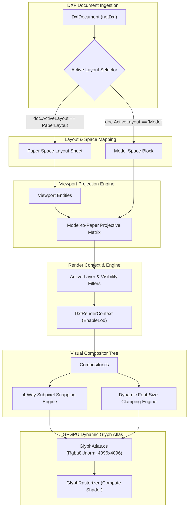

---

## 1. Bulge Arc Geometry & Scanline-Perfect Interpolation

In DXF polyline entities, circular curves are represented using **bulge** values on vertices. A bulge segment represents a circular arc connecting two consecutive vertices.

### A. Mathematical Definitions
Let:
* $P_1 = (x_1, y_1)$ be the starting vertex of the segment.
* $P_2 = (x_2, y_2)$ be the ending vertex of the segment.
* $b$ be the bulge value of the vertex at $P_1$.

The bulge $b$ is mathematically defined as the tangent of one-fourth of the included angle ($\theta$) of the arc:
$$b = \tan\left(\frac{\theta}{4}\right)$$

From this, the signed sweep angle $\theta$ of the arc is:
$$\theta = 4 \arctan(b)$$

A positive bulge ($b > 0$) indicates a **Counter-Clockwise (CCW)** sweep from $P_1$ to $P_2$, while a negative bulge ($b < 0$) indicates a **Clockwise (CW)** sweep. A bulge of $0$ represents a straight line segment.

### B. Center and Radius Derivation
Let the chord vector from $P_1$ to $P_2$ be:
$$\vec{v}_{chord} = P_2 - P_1$$
The length of the chord is:
$$d = \|\vec{v}_{chord}\| = \sqrt{(x_2 - x_1)^2 + (y_2 - y_1)^2}$$

The midpoint of the chord is:
$$P_{mid} = \frac{P_1 + P_2}{2}$$

The perpendicular unit vector pointing to the **left** of the directed segment $P_1 \to P_2$ (rotated 90 degrees CCW) is:
$$\hat{n}_{perp} = \frac{(-(y_2 - y_1), x_2 - x_1)}{d}$$

The radius of the arc $r$ is derived from the chord length $d$ and bulge $b$:
$$r = d \cdot \frac{1 + b^2}{4b}$$

The signed distance (sagitta or height $h$) from the chord midpoint $P_{mid}$ to the arc's center is:
$$h = d \cdot \frac{1 - b^2}{4b}$$

The mathematical center $C$ of the circular sweep is:
$$C = P_{mid} + \hat{n}_{perp} \cdot h$$

#### Mathematical Behavior of the Sign of $h$:
1. **Minor Arcs ($|b| < 1$, i.e., $|\theta| < 180^\circ$):**
   * For $b > 0$ and $b < 1$, the sagitta height is positive ($h > 0$). The center $C$ is offset in the direction of $+\hat{n}_{perp}$ (to the left of the segment), placing the center on the concave side of the sweep.
2. **Major Arcs ($|b| > 1$, i.e., $|\theta| > 180^\circ$):**
   * Since $b > 1$, the height term becomes negative ($h < 0$). The offset $+\hat{n}_{perp} \cdot h$ naturally reverses direction, placing the center on the opposite (right) side of the chord, matching the geometry of major arcs.
3. **Clockwise Arcs ($b < 0$):**
   * The negative sign of $b$ flips the signs of both $r$ and $h$, mathematically adjusting the center offset direction and radius values seamlessly.

### C. Angle-Based Sweep Interpolation
To render the arc as a smooth set of linear segments, the polar angles of $P_1$ and $P_2$ relative to the center $C$ are computed:
$$\theta_1 = \text{atan2}(P_{1y} - C_y, P_{1x} - C_x)$$
$$\theta_2 = \text{atan2}(P_{2y} - C_y, P_{2x} - C_x)$$

To ensure the sweep wraps correctly around the circle without crossing the boundary line incorrectly, we apply the following angle corrections:
* **For Counter-Clockwise sweeps ($b > 0$):** If $\theta_2 < \theta_1$, we add $2\pi$ to $\theta_2$:
  $$\theta_2 = \theta_2 + 2\pi$$
* **For Clockwise sweeps ($b < 0$):** If $\theta_2 > \theta_1$, we subtract $2\pi$ from $\theta_2$:
  $$\theta_2 = \theta_2 - 2\pi$$

The vertices along the arc are then generated by interpolating $t \in [0, 1]$ over $N$ segments:
$$\theta(t) = \theta_1 + t(\theta_2 - \theta_1)$$
$$P(t) = C + |r| \cdot (\cos(\theta(t)), \sin(\theta(t)))$$

Refer to [DxfEntityRenderers.cs](file:///Users/wieslawsoltes/GitHub/ProGPU/src/ProGPU.Dxf/DxfEntityRenderers.cs) for the concrete implementation of bulge arc segmentation.

---

## 2. Spatial Transformations and Coordinate Reference Frames

In DXF, reusable components are declared in `Block` definitions and instanced using `Insert` entities. Projecting these block coordinate spaces into the World Coordinate System (WCS) requires rigorous Handling of Object Coordinate Systems (OCS).

### A. Object Coordinate System (OCS) & Arbitrary Axis Algorithm
Every CAD entity has an extrusion direction represented by a normal vector $N = (N_x, N_y, N_z)$. If $N \neq (0, 0, 1)$, the entity's coordinates are defined in its local OCS. The OCS axes $\hat{W}_x$ and $\hat{W}_y$ are derived from $N$ using the **Arbitrary Axis Algorithm**:
1. Check if the normal vector is close to the global Z-axis using an absolute limit:
   $$\text{limit} = \frac{1}{64}$$
   If $|N_x| < \text{limit}$ and $|N_y| < \text{limit}$, the local intermediate X-axis is the cross product of the global Y-axis and $N$:
   $$\vec{W}_x = (0, 1, 0) \times N$$
   Otherwise, it is the cross product of the global Z-axis and $N$:
   $$\vec{W}_x = (0, 0, 1) \times N$$
2. Normalize $\vec{W}_x$ to find the unit axis:
   $$\hat{W}_x = \frac{\vec{W}_x}{\|\vec{W}_x\|}$$
3. The local unit Y-axis $\hat{W}_y$ is the cross product of $N$ and $\hat{W}_x$:
   $$\hat{W}_y = \frac{N \times \hat{W}_x}{\|N \times \hat{W}_x\|}$$

The resulting OCS-to-WCS rotation matrix is:
$$M_{ocs} = \begin{pmatrix} \hat{W}_{xx} & \hat{W}_{xy} & \hat{W}_{xz} & 0 \\ \hat{W}_{yx} & \hat{W}_{yy} & \hat{W}_{yz} & 0 \\ N_x & N_y & N_z & 0 \\ 0 & 0 & 0 & 1 \end{pmatrix}$$

### B. Non-Commutative Insertion Transformation Sequence
Let:
* $\vec{o}$ be the base origin coordinate of the `Block` definition.
* $S = (S_x, S_y, S_z)$ be the local insert scale factors.
* $\phi$ be the insert rotation angle (around the local Z-axis, in radians).
* $\vec{p}$ be the insertion point coordinate of the `Insert` entity in parent space.
* $M_{ocs}$ be the OCS-to-WCS rotation matrix derived from the insert's normal.

In standard row-vector right-multiplication notation, affine transformations are applied left-to-right. The correct cumulative transformation matrix $M_{\text{local}}$ is:
$$M_{\text{local}} = T(-\vec{o}) \cdot \text{Scale}(S_x, S_y, S_z) \cdot \text{Rot}_z(\phi) \cdot M_{ocs} \cdot T(\vec{p})$$

Where:
1. $T(-\vec{o})$ translates local block space to center the block origin at $(0, 0, 0)$.
2. $\text{Scale}(S)$ applies the local scaling factors.
3. $\text{Rot}_z(\phi)$ applies rotation around the local Z-axis.
4. $M_{ocs}$ rotates the scaled and rotated local coordinates into WCS orientation.
5. $T(\vec{p})$ translates the oriented block reference to its insertion point in WCS/parent space.

#### Mathematical Analysis of the Mirrored Normal Coordinate Anomaly:
In older CAD implementations, the insertion point translation was applied *before* the OCS rotation:
$$M_{\text{buggy}} = T(-\vec{o}) \cdot \text{Scale}(S) \cdot \text{Rot}_z(\phi) \cdot T(\vec{p}) \cdot M_{ocs}$$

If an insert has a mirrored normal pointing downwards ($N = (0, 0, -1)$), the derived $M_{ocs}$ acts as a reflection matrix across the YZ-plane:
$$M_{ocs} = \begin{pmatrix} -1 & 0 & 0 & 0 \\ 0 & 1 & 0 & 0 \\ 0 & 0 & -1 & 0 \\ 0 & 0 & 0 & 1 \end{pmatrix}$$

By translating by $\vec{p}$ *before* this reflection is applied, the insertion coordinate $p_x$ is post-multiplied by $-1$, yielding:
$$x_{\text{world}} = -p_x$$

This misplaced mirrored inserts (such as valve icons and pumps) thousands of units to the far left of the drawing. Correcting the order to translate by $\vec{p}$ **after** the rotation matrix $M_{ocs}$ ensures the insertion point coordinates remain unaffected by the local OCS reflection, maintaining the correct WCS placement.

Refer to [DxfEntityRenderers.cs](file:///Users/wieslawsoltes/GitHub/ProGPU/src/ProGPU.Dxf/DxfEntityRenderers.cs#L825-L862) for the block insert transformation pipeline.

---

## 3. Object Coordinate System (OCS) Projection for Annotation Elements

Text (`Text`) and Multiline Text (`MText`) entities nested inside blocks are written in the block's local OCS coordinates.

### A. The OCS Annotation Misalignment Anomaly
Standard vector elements (lines, circles) had the parent OCS matrix applied automatically. However, the annotation rendering pipeline bypassed the entity normal's OCS matrix, transforming text coordinates using only the base parent translation:
$$\text{screenPos} = \text{Transform}(P_{\text{text}}, M_{\text{parent}})$$

For text nested inside mirrored blocks ($Normal = (0,0,-1)$), this bypassed the mirroring transform. While the surrounding valve icons and pipelines were correctly flipped in-place, the text labels floated far away at their raw coordinates.

### B. The Mathematical Solution
We integrated the entity's OCS matrix directly inside the text and multiline text renderers:
$$M_{\text{combined}} = M_{ocs}(\text{text.Normal}) \cdot M_{\text{parent}}$$
$$\text{screenPos} = \text{Transform}(P_{\text{text}}, M_{\text{combined}})$$

This ensures all nested labels, tags, and annotations mirror and rotate in-place, maintaining exact alignments with their associated inserts.

Refer to [DxfEntityRenderers.cs](file:///Users/wieslawsoltes/GitHub/ProGPU/src/ProGPU.Dxf/DxfEntityRenderers.cs#L503-L508) for OCS handling inside the text rendering pipeline.

---

## 4. Block Attributes (ATTRIB) and Dynamic Visibility Filtering

Block insert attributes (`ATTRIB` entities attached to an `Insert`) represent dynamic text labels linked to instanced blocks.

### A. Invisible Placeholders Filtering
AutoCAD blocks write placeholder attributes (e.g. metadata for diameter, material, or flow types) that are marked as invisible. In `netDxf`, this corresponds to the `AttributeFlags.Hidden` flag.
We bypass rendering and bounding box accumulation for these entities to maintain a clean layout:
Let $a$ represent an attribute with flag register $F_a \in \mathbb{N}$ and hidden bitmask $H \in \mathbb{N}$. The filtering predicate is:
$$\text{Render}(a) = \emptyset \quad \text{if} \quad (F_a \ \& \ H) \neq 0$$

### B. Double-Scaling Correction
`ATTRIB` entities are written in parent coordinates, and their `Height` value is already pre-scaled by the authoring software according to the insert's scale. 
To prevent oversized text artifacts (e.g. text scaling up by $550\times$), we removed the redundant height scale multiplier, using the pre-scaled height directly:
$$\text{screenFontSize} = \text{Height}_{attr} \cdot \text{screenScale}$$

### C. Layer-Aware Zoom to Fit Bounds
To prevent far-out coordinate outliers residing on hidden layers from throwing off "Zoom to Fit Bounds", we updated the bounds accumulation to be layer-aware. Let:
* $\mathcal{E}$ be the set of all entities in the active layout.
* $\mathcal{L}_{\text{active}}$ be the set of active (visible) layers.
* $\text{Layer}(e)$ be the layer name of entity $e$.

The bounds accumulators $\vec{p}_{\min}$ and $\vec{p}_{\max}$ are defined as:
$$\vec{p}_{\min} = \min_{e \in \mathcal{E} \mid \text{Layer}(e) \in \mathcal{L}_{\text{active}}} \text{MinBounds}(e)$$
$$\vec{p}_{\max} = \max_{e \in \mathcal{E} \mid \text{Layer}(e) \in \mathcal{L}_{\text{active}}} \text{MaxBounds}(e)$$

This restricts the calculated bounds exactly to visible geometries, resolving the zoomed-out layout presentation completely.

Refer to [DxfDocumentRenderer.cs](file:///Users/wieslawsoltes/GitHub/ProGPU/src/ProGPU.Dxf/DxfDocumentRenderer.cs#L169-L216) for the layer-aware bounding box calculations.

---

## 5. Model Space and Paper Space Layout Configurations

DXF files organize drawing elements into virtual layout boundaries. The two primary categories of drawing environments are:
1. **Model Space (`"Model"`)**: The unified 2D/3D coordinate canvas where the primary design geometries and model elements are authored.
2. **Paper Space (Layout Sheets)**: Sheet configurations representing physical printing pages, containing title blocks, annotations, frames, and **Viewports** projecting specific areas of Model Space.

### A. Layout Selection Mechanics
Layout blocks are mapped dynamically:
* The active layout name is parsed from `doc.ActiveLayout`.
* If a matching layout is found, the engine retrieves the layout block.
* If the layout has a valid `AssociatedBlock`, the engine iterates and renders elements declared directly within the layout sheet boundary.
* If no active layout exists or the layout contains no valid block entities, the engine falls back to scanning flat document collections (`doc.Lines`, `doc.Circles`, etc.) to guarantee drawing display.

Refer to [DxfDocumentRenderer.cs](file:///Users/wieslawsoltes/GitHub/ProGPU/src/ProGPU.Dxf/DxfDocumentRenderer.cs#L54-L80) for layout selection handling.

---

## 6. Viewport Projection & Screen-Space Culling Boundaries

Paper Space layouts utilize `Viewport` entities to frame sections of the Model Space. Viewports act as localized coordinate transformations.

### A. Projective Scale & Shift Mathematics
Let a Paper Space viewport entity have the following attributes:
* $\text{vp.Center} = (C_{px}, C_{py})$: The 2D center position of the viewport on the Paper Space sheet.
* $\text{vp.Width}, \text{vp.Height}$: The physical width and height dimensions of the viewport frame on the paper.
* $\text{vp.ViewCenter} = (V_{mx}, V_{my})$: The projected target center position in Model Space.
* $\text{vp.ViewHeight}$: The height dimension of the projected window in Model Space.

The viewport scale factor $S_{viewport}$ is:
$$S_{viewport} = \frac{\text{vp.Height}}{\text{vp.ViewHeight}}$$

This scale converts coordinates from Model Space to Paper Space dimensions.

The combined Model Space to Paper Space projective matrix $M_{viewport}$ shifts coordinates from Model Space relative to `vp.ViewCenter`, scales them by $S_{viewport}$, and translates them to `vp.Center` on the sheet:
$$M_{viewport} = T(-\text{ViewCenter}_x, -\text{ViewCenter}_y, 0) \times \text{Scale}(S_{viewport}, S_{viewport}, 1) \times T(\text{Center}_x, \text{Center}_y, 0)$$

For any vector $\vec{v}_{model}$ inside Model Space, its corresponding projected Paper Space coordinate $\vec{v}_{paper}$ is:
$$\vec{v}_{paper} = \vec{v}_{model} \times M_{viewport}$$

Applying the parent transform $M_{parent}$ projects the Paper Space sheet coordinate to final world/screen coordinates:
$$M_{combined} = M_{viewport} \times M_{parent}$$

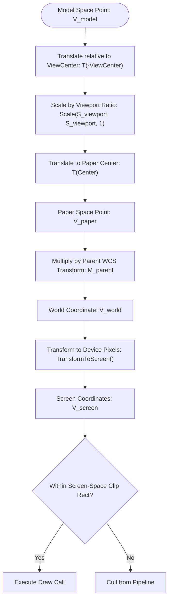

### B. Screen-Space Clipping Bounds
To prevent Model Space entities from bleeding outside of the physical viewport boundary frame on the paper sheet, screen-space clipping is enforced:
1. Define the viewport's Paper Space bounding box:
   $$P_{min} = \left(\text{vp.Center}_x - \frac{\text{vp.Width}}{2}, \text{vp.Center}_y - \frac{\text{vp.Height}}{2}\right)$$
   $$P_{max} = \left(\text{vp.Center}_x + \frac{\text{vp.Width}}{2}, \text{vp.Center}_y + \frac{\text{vp.Height}}{2}\right)$$
2. Transform $P_{min}$ and $P_{max}$ to absolute device screen coordinates (pixels):
   $$S_{min} = \text{TransformToScreen}(P_{min})$$
   $$S_{max} = \text{TransformToScreen}(P_{max})$$
3. Compute the axis-aligned screen-space rectangular clip frame:
   $$X_{clip} = \min(S_{min.x}, S_{max.x})$$
   $$Y_{clip} = \min(S_{min.y}, S_{max.y})$$
   $$W_{clip} = |S_{max.x} - S_{min.x}|$$
   $$H_{clip} = |S_{max.y} - S_{min.y}|$$
4. Enforce clipping prior to rendering any Model Space entity inside the viewport:
   ```text
   PushClipState(X_clip, Y_clip, W_clip, H_clip)
   RenderEntities(ModelSpace)
   PopClipState()
   ```

Refer to [DxfEntityRenderers.cs](file:///Users/wieslawsoltes/GitHub/ProGPU/src/ProGPU.Dxf/DxfEntityRenderers.cs#L864-L928) for the viewport clipping and projection rendering loop.

---

## 7. Multiline Text Formatting Parsing and Character Sanitization

Multiline Text (`MText`) entities in DXF support complex formatting tags embedded within their string fields (such as font face, color, line height ratios, and paragraph breaks).

To prevent format tags from rendering as raw text noise (e.g. rendering `\fArial|b0|i0;\H0.75x;Main Pipeline`), a cleaning algorithm is executed:

### A. Sanitization Stages
The cleaning procedure behaves as a linear reduction pipeline:
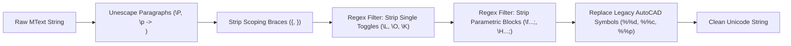
1. **Paragraph Splits**: Translate paragraph break escape codes (`\P` or `\p`) directly to native newline breaks (`\n`).
2. **Nesting Braces**: Strip out curly style-scoping boundaries `{` and `}`.
3. **Single Toggle Codes**: Remove style switches using the regular expression `\\[L|l|O|o|K|k]` (underline, overline, and strike-through).
4. **Parametric Blocks**: Remove complex semicolon-terminated property blocks using the regular expression `\\[A-Za-z0-9_|\.\s\-\^/#]+;` (font face, relative height scales, aspect ratio width, slant/oblique angles, stacked fractions).
5. **Special Characters Mapping**: Map legacy AutoCAD drafting characters to standard Unicode characters:
   * `%%d` or `%%D` $\to$ `°` (Degrees symbol)
   * `%%c` or `%%C` $\to$ `Ø` (Diameter symbol)
   * `%%p` or `%%P` $\to$ `±` (Plus-Minus symbol)

Refer to [DxfEntityRenderers.cs](file:///Users/wieslawsoltes/GitHub/ProGPU/src/ProGPU.Dxf/DxfEntityRenderers.cs#L797-L822) for the multiline text cleaning algorithm.

---

## 8. Geometry Specifications for Leaders, Dimensions, and Solids

To achieve exact vector drafting look-and-feel, specialized geometric renderers are implemented.

### A. Leader Arrowheads & Segment Accumulation
A leader consists of a multi-segment line terminating in a directional arrowhead pointing to the first vertex.
Let the first two vertices of the leader line be $V_0 = (v_{0x}, v_{0y})$ and $V_1 = (v_{1x}, v_{1y})$:
1. Compute the normalized direction vector pointing from $V_0$ to $V_1$:
   $$\vec{d} = \text{Normalize}(V_1 - V_0)$$
2. Compute the corresponding 2D perpendicular normal vector:
   $$\vec{n} = (-d_y, d_x)$$
3. Define the arrowhead dimensions (length $L = 2.5$ world units, width ratio $W = 0.4 \cdot L$):
   * The arrow tip lies at the leader start coordinate:
     $$\vec{p}_{tip} = V_0$$
   * The back-left corner of the arrowhead:
     $$\vec{p}_{left} = V_0 + \vec{d} \cdot L + \vec{n} \cdot W$$
   * The back-right corner of the arrowhead:
     $$\vec{p}_{right} = V_0 + \vec{d} \cdot L - \vec{n} \cdot W$$
4. Draw the three boundary vectors of the arrowhead tip, then start drawing subsequent leader polyline lines from the arrowhead backing connector point ($V_0 + \vec{d} \cdot L$).

Refer to [DxfLeaderRenderer.cs](file:///Users/wieslawsoltes/GitHub/ProGPU/src/ProGPU.Dxf/DxfLeaderRenderer.cs) for the arrowhead construction and segment rendering loops.

### B. Pre-compiled Dimension Blocks
Rather than re-calculating complex dimension arrows, extension lines, spacing gaps, and text offset settings on-the-fly, DXF `Dimension` entities contain an associated pre-compiled graphical `Block` holding all primitive visual vectors. The dimension renderer extracts these visual block collections and maps them using the parent coordinate transformations to preserve the draftsman's exact geometric layout.

Refer to [DxfDimensionRenderer.cs](file:///Users/wieslawsoltes/GitHub/ProGPU/src/ProGPU.Dxf/DxfDimensionRenderer.cs) for details.

### C. SOLID Winding Order
A DXF `Solid` represents a filled quadrilateral defined by four points ($V_1, V_2, V_3, V_4$). However, the native DXF database stores these coordinates in a cross-winding pattern:
$$\text{Winding Path: } V_1 \to V_2 \to V_4 \to V_3 \to V_1$$

Drawing the outline or filling the polygon using standard clockwise sequences ($V_1 \to V_2 \to V_3 \to V_4$) results in a self-intersecting bow-tie shape. Correcting the winding order to map vertices in cross order ensures correct, solid quadrilaterals.

Refer to [DxfEntityRenderers.cs](file:///Users/wieslawsoltes/GitHub/ProGPU/src/ProGPU.Dxf/DxfEntityRenderers.cs#L929-L957) for details.

---

## 9. Dynamic Glyph Atlas Caching and High-DPI Subpixel Snapping

High-fidelity text rendering in **ProGPU** uses a hardware-accelerated GPGPU glyph rasterization engine that outputs Retina-quality vectors.

### A. Physical DPI Scaling
To prevent OS-level linear stretching blur, the swapchain is backed by physical framebuffer dimensions. The current high-DPI scale ratio is computed dynamically from the window context:
$$DpiScale = \frac{\text{FramebufferSize}_x}{\text{WindowSize}_x}$$

The target font size rasterized inside the atlas is scaled to physical dimensions:
$$\text{FontSize}_{physical} = \text{FontSize}_{logical} \cdot DpiScale$$

### B. 4-Way Subpixel Alignment Snapping
To maintain razor-sharp text stems and prevent sub-pixel color bleeding, glyph positions are aligned on physical sub-pixel boundaries:
1. For any logical text offset coordinate $\vec{p}$, transform to physical coordinates:
   $$\vec{p}_{physical} = \vec{p} \cdot DpiScale$$
2. Snap the X-coordinate to the nearest $1/4$th of a physical pixel, and round the Y-coordinate to the nearest physical integer pixel:
   $$\text{subIdx} = \text{Round}\left(\left(p_{physical.x} - \lfloor p_{physical.x} \rfloor\right) \cdot 4\right)$$
   $$\text{subpixelX} = \text{subIdx} \cdot 0.25$$
   $$x_{snapped} = \lfloor p_{physical.x} \rfloor + \text{subpixelX}$$
   $$y_{snapped} = \text{Round}(p_{physical.y})$$
3. Back-project the snapped physical coordinates into logical projection matrix coordinate space for rendering:
   $$\vec{v}_{logical} = \frac{(x_{snapped}, y_{snapped})}{DpiScale}$$

This 4-way subpixel snap eliminates bilinear blurring on vertical stems, providing macOS-quality typography.

Refer to [Compositor.cs](file:///Users/wieslawsoltes/GitHub/ProGPU/src/ProGPU.Scene/Compositor.cs#L2231-L2271) for the subpixel snapping algorithm.

### C. Shelf-Packing & Texture Bleeding Safety
Glyphs are packed into a unified WebGPU storage texture format (`Rgba8Unorm`) of size $4096 \times 4096$ using a shelf-packing packer:
* Packing begins at offset $(2, 2)$ to avoid border-pixel coordinate interpolation bleeding.
* A safety margin of $4\text{px}$ padding is added to all sides of each glyph's bounding box:
  $$\text{padding} = 4\text{px}$$
  $$\text{width}_{packed} = \text{Ceiling}(x_{end}) - \text{Floor}(x_{start}) + 8$$
* This padding ensures that bilinear filtering at the edges of glyphs does not interpolate adjacent glyph colors, preventing background artifacts or edge clipping.

Refer to [GlyphAtlas.cs](file:///Users/wieslawsoltes/GitHub/ProGPU/src/ProGPU.Text/GlyphAtlas.cs) for the shelf-packing and WebGPU resource allocation details.

### D. Zoom Anti-Artifacting & Proactive Frame-Start Cleans
During continuous smooth zooming, hundreds of newly generated physical font sizes and subpixel variations are continuously allocated in the packer. This can exhaust the available atlas texture area.
* **The Mid-Frame Eviction Bug**: Previously, if the atlas filled up in the *middle* of a render pass (e.g., during DXF canvas compilation after the UI sidebars had already been processed), it would trigger an immediate texture clear. Consequently, visual elements compiled *before* this clear (such as sidebars or navigation items cached via `CacheAsLayer`) would retain outdated UV coordinates that now mapped to completely random newly packed characters, leading to permanently scrambled text.
* **The Proactive Solution**:
  1. Increased the default dimensions of the texture atlas to $2048 \times 2048$ (or $4096 \times 4096$ dynamically), expanding capacity 4-fold (storing over $16,000$ concurrent character variations).
  2. Implemented a proactive utilization metric `IsAlmostFull` that flags when the shelf-packer height utilization exceeds $85\%$ of the texture height:
     $$\text{IsAlmostFull} = (Y_{\text{current}} + H_{\text{row}}) > 0.85 \cdot \text{AtlasSize}$$
  3. This check is run proactively at the absolute start of the `RenderScene` pass in `Compositor.cs`. If utilization is exceeded, the atlas is cleared **before** any visual tree node begins compiling. This guarantees that the entire frame is processed against a single, static texture layout, eliminating mid-frame evictions.

Refer to [Compositor.cs](file:///Users/wieslawsoltes/GitHub/ProGPU/src/ProGPU.Scene/Compositor.cs#L519-L523) and [GlyphAtlas.cs](file:///Users/wieslawsoltes/GitHub/ProGPU/src/ProGPU.Text/GlyphAtlas.cs#L48-L62) for implementation.

### E. Font-Size Clamping and Bilinear Scaling
When rendering CAD drawings with text elements authored at huge dimensions in Model Space (e.g. $1000\text{f}$ height), physical scaling factors would scale physical heights to thousands of pixels:
$$\text{FontSize}_{\text{physical}} = \text{FontSize}_{\text{model}} \cdot \text{DpiScale} \cdot S_{\text{camera}}$$

Attempting to rasterize these gigantic characters directly would instantly exhaust the $4096 \times 4096$ texture atlas in a single frame, leading to continuous atlas clearing and severe text scrambling.
* **The Clamping and Scaling Solution**:
  1. Clamped the physical font size dynamically prior to GPGPU rasterization:
     $$\text{FontSize}_{\text{raster}} = \text{Clamp}(\text{FontSize}_{\text{physical}}, 4\text{px}, 128\text{px})$$
  2. Rasterize and cache characters in the glyph atlas strictly at the capped $\text{FontSize}_{\text{raster}}$, keeping texture memory extremely compact.
  3. Calculate the proportional scale ratio:
     $$S_{\text{ratio}} = \frac{\text{FontSize}_{\text{physical}}}{\text{FontSize}_{\text{raster}}}$$
  4. In the vertex shader layout stage, expand the quad coordinates proportionally by $S_{\text{ratio}}$ while utilizing the hardware GPU's bilinear texture filtering:
     $$\vec{x}_{\text{vertex}} = \vec{x}_{\text{snapped}} + \vec{x}_{\text{offset}} \cdot S_{\text{ratio}}$$
  - This preserves perfect rendering speeds, maintains sharp typography, and completely prevents atlas capacity blowouts.

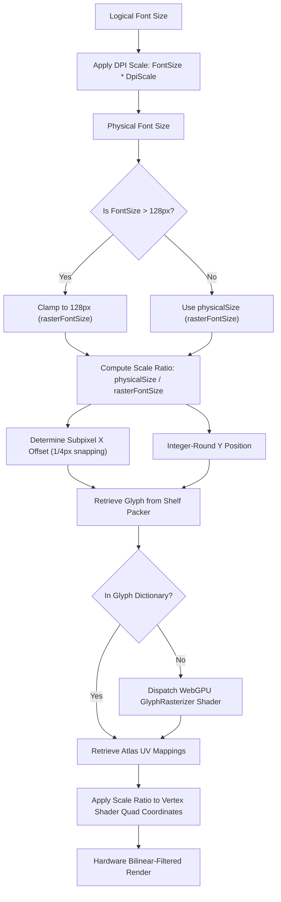

Refer to [Compositor.cs](file:///Users/wieslawsoltes/GitHub/ProGPU/src/ProGPU.Scene/Compositor.cs#L2273-L2279) for details.

---

## 10. Level of Detail (LOD) Optimization Rules

To handle large-scale schematics, an interactive Level of Detail (LOD) optimization engine is provided. It can be toggled dynamically via the UI checkbox or the `EnableLod` configuration flag.

### A. Dynamic Curve Segment Scaling
When LOD is enabled, the interpolation segment count for circles, arcs, ellipses, and polylines scales dynamically with their physical screen radius $R_{screen}$ to reduce vertex processing overhead:

| Entity Type | Screen Radius Range ($R_{screen}$) | LOD Segment Count | Default (LOD Off) |
| :--- | :--- | :--- | :--- |
| **Circle** | $R_{screen} < 5\text{px}$ | **8** | 64 |
| | $R_{screen} < 15\text{px}$ | **12** | 64 |
| | $R_{screen} < 50\text{px}$ | **24** | 64 |
| | $R_{screen} < 150\text{px}$ | **36** | 64 |
| | Otherwise | **64** | 64 |
| **Arc** | $R_{screen} < 5\text{px}$ | **6** | 64 |
| | $R_{screen} < 15\text{px}$ | **12** | 64 |
| | $R_{screen} < 50\text{px}$ | **18** | 64 |
| | $R_{screen} < 150\text{px}$ | **24** | 64 |
| | Otherwise | **32** | 64 |
| **Ellipse** | $R_{screen} < 5\text{px}$ | **8** | 64 |
| | $R_{screen} < 15\text{px}$ | **16** | 64 |
| | $R_{screen} < 50\text{px}$ | **24** | 64 |
| | $R_{screen} < 150\text{px}$ | **36** | 64 |
| | Otherwise | **64** | 64 |
| **Bulge Segment**| $R_{screen} < 5\text{px}$ | **4** | 16 |
| | $R_{screen} < 15\text{px}$ | **8** | 16 |
| | $R_{screen} < 50\text{px}$ | **12** | 16 |
| | Otherwise | **16** | 16 |

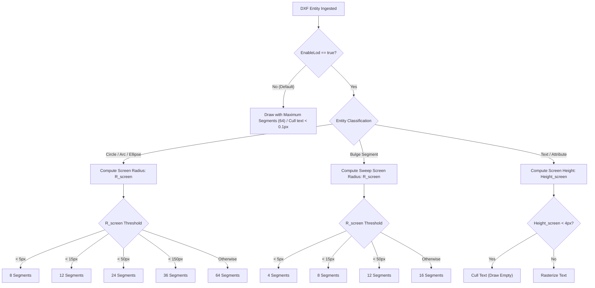

### B. Screen-Space Text Culling Thresholds
Text rasterization represents a high-overhead rendering path. The engine enforces the following culling rules based on physical size:
* **LOD Enabled**: If the computed physical text height $\text{Height}_{screen} < 4\text{px}$, drawing is bypassed entirely.
* **LOD Disabled**: If the computed physical text height $\text{Height}_{screen} < 0.1\text{px}$, drawing is bypassed entirely.

This maintains layout fidelity when zoom-out is maximum while avoiding costly, illegible glyph rasterization.

Refer to [DxfEntityRenderers.cs](file:///Users/wieslawsoltes/GitHub/ProGPU/src/ProGPU.Dxf/DxfEntityRenderers.cs#L507) for the LOD culling triggers.

---

## 11. Command-Line Diagnostics (`DxfDiag`)

To debug text alignment, coordinate anomalies, and out-of-bounds geometries, a high-performance command-line analysis tool is provided.

### A. Outliers Coordinate Detection Criteria
`DxfDiag` scans all drawing entities, computing active local-to-world block transformations. Any coordinate point $\vec{p} = (x, y)$ that meets either of the following criteria is flagged:
1. **NaN or Infinity values**: Corrupted parsing blocks.
2. **Absolute Outliers**:
   $$|x| > 1,000,000 \quad \text{or} \quad |y| > 1,000,000$$

These coordinates represent far-out outliers (often misplaced layout frames or stray lines on hidden layers) that force camera zoom-to-fit bounds to shrink drawing views to microscopic scales.

### B. Traversal Architecture
The diagnostic tool walks the layout block hierarchically using recursive depth-first scanning. Let $\text{Scan}(e, M)$ represent the traversal of entity $e$ with transformation matrix $M$:
* For primitive entities (Lines, Arcs, Text), compute WCS coordinates:
  $$\vec{x}_{\text{WCS}} = \text{Transform}(\vec{x}_{\text{local}}, M)$$
  Flag as outlier if $\|\vec{x}_{\text{WCS}}\|_{\infty} > 10^6$.
* For block references (`Insert` entities), construct the compound block matrix $M_{\text{local}}$ and recursively descend:
  $$M_{\text{child}} = M_{\text{local}} \cdot M$$
  $$\forall c \in \text{BlockEntities}, \quad \text{Scan}(c, M_{\text{child}})$$

Refer to [Program.cs](file:///Users/wieslawsoltes/GitHub/ProGPU/tools/DxfDiag/Program.cs) for the complete command-line diagnostics implementation.

---

## 12. 3DFACE, POINT, ATTDEF, and WIPEOUT Vector Geometry Projections

To support advanced structural CAD drafts, the ProGPU engine implements precise vector projections for planar 3D faces (`3DFACE`), coordinate nodes (`POINT`), attribute templates (`ATTDEF`), and polygon-masked areas (`WIPEOUT`).

### A. 3DFACE Planar Projections
`3DFACE` represents planar 3D polygons in CAD drawings. Let the four vertices of the face in local coordinate space be:
$$v_1 = (x_1, y_1, z_1), \quad v_2 = (x_2, y_2, z_2), \quad v_3 = (x_3, y_3, z_3), \quad v_4 = (x_4, y_4, z_4)$$

To render the 3D planar face onto the 2D projection plane:
1. Extract the OCS-to-WCS rotation matrix $M_{\text{ocs}}$ using the Arbitrary Axis Algorithm from the face normal vector $N = (N_x, N_y, N_z)$.
2. Calculate the compound transformation matrix:
   $$M_{\text{combined}} = M_{\text{ocs}} \cdot M_{\text{transform}}$$
3. Project the 3D vertices to the 2D screen space:
   $$p_i = \text{Transform}(v_i, M_{\text{combined}}) \quad \forall i \in \{1, 2, 3, 4\}$$
4. **Winding Interval Closure**:
   * If $v_3 = v_4$, the entity is topologically a triangle. Render lines: $p_1 \to p_2$, $p_2 \to p_3$, and $p_3 \to p_1$.
   * If $v_3 \neq v_4$, the entity is a quadrilateral. Render lines: $p_1 \to p_2$, $p_2 \to p_3$, $p_3 \to p_4$, and $p_4 \to p_1$.

### B. POINT Coordinate Nodes
A `POINT` represents a single coordinate mark. To prevent pixel-dropout at low zoom levels, ProGPU projects the position $p_0 = (x_0, y_0, z_0)$ using the intermediate OCS normal matrix:
$$p_{\text{screen}} = \text{Transform}(p_0, M_{\text{ocs}} \cdot M_{\text{transform}})$$

To ensure visibility matching CAD draft standards, it is rendered as a vector cross-hair centered at $p_{\text{screen}}$ with a half-size $s = 1.5\text{px}$:
$$\text{Line}_1 = \left(p_{\text{screen}} - (s, 0), \ p_{\text{screen}} + (s, 0)\right)$$
$$\text{Line}_2 = \left(p_{\text{screen}} - (0, s), \ p_{\text{screen}} + (0, s)\right)$$

### C. ATTDEF Attribute Templates
Attribute definitions (`ATTDEF`) represent template tags in block definitions. Similar to standard text entities, they define height, rotation, and alignment.
Let $T_{\text{tag}}$ be the attribute tag string, $\theta$ be the rotation angle, $h$ be the template font height, and $A$ be the text alignment enum.
1. The baseline rotation is transformed using the OCS-to-WCS combined matrix to obtain the directional unit baseline vector $\hat{u}$ and perpendicular height vector $\hat{v}$:
   $$\hat{u} = (\cos\theta, \sin\theta), \quad \hat{v} = (-\sin\theta, \cos\theta)$$
2. Shift factors are derived dynamically from text alignment metrics:
   $$\text{Shift}_x = -w_{\text{text}} \cdot \alpha_h, \quad \text{Shift}_y = h_{\text{font}} \cdot \alpha_v$$
   where $\alpha_h \in \{0.0, 0.5, 1.0\}$ represents the horizontal alignment shift factor and $\alpha_v \in \{0.0, 0.5, 1.0\}$ is the vertical baseline factor.
3. The final text baseline origin $P_{\text{draw}}$ is:
   $$P_{\text{draw}} = P_{\text{screen}} + \hat{u} \cdot \text{Shift}_x + \hat{v} \cdot \text{Shift}_y$$

### D. WIPEOUT Polygon Masking
`WIPEOUT` entities provide polygon-based visual clipping/masking of background details. 
A wipeout maintains a closed `ClippingBoundary` consisting of $N$ boundary vertices $w_i = (x_i, y_i)$ in OCS space.

To implement the masking layer:
1. Transform each vertex $w_i$ into the screen coordinate space:
   $$p_i = \text{Transform}(w_i, M_{\text{ocs}} \cdot M_{\text{transform}})$$
2. Cull the entire wipeout polygon if its screen bounding box is off-screen.
3. Construct a closed `PathGeometry` using sequential segments:
   $$\text{Path} = \left\{ \text{StartPoint} = p_0, \ \text{Segments} = \bigcup_{i=1}^{N-1} \text{LineSegment}(p_i), \ \text{IsClosed} = \text{true} \right\}$$
4. Draw the filled path to the GPU compositor using the context's dynamic canvas background brush:
   $$\text{Mask} = \text{DrawPath}\left(context.BackgroundBrush, \ \text{null}, \ \text{Path}\right)$$

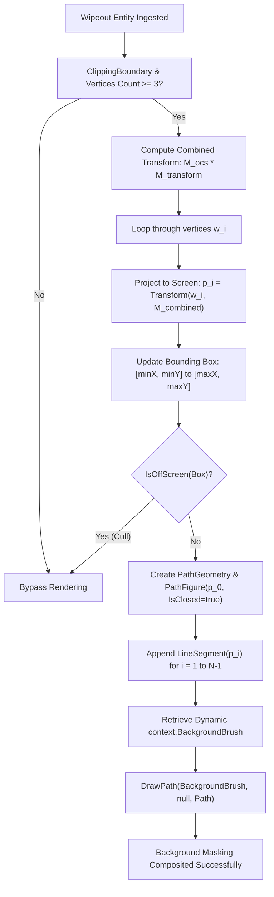

Refer to [DxfEntityRenderers.cs](file:///Users/wieslawsoltes/GitHub/ProGPU/src/ProGPU.Dxf/DxfEntityRenderers.cs#L1206) for the complete Wipeout masking code.

## 13. Direct GPU Triangulation, Procedural Hatch Shaders, NURBS Evaluation, and ACIS SAT 3D Projections

### A. Direct Hardware Solid Fills ($ShapeType = 7u$)
Standard 2D graphics systems draw solid-filled entities (`SOLID`, `3DFACE`, `WIPEOUT`) by compiling curves and borders to complex offscreen coverage maps or computing slow Signed Distance Field (SDF) values at runtime. To bypass this computational bottleneck and achieve zero-overhead rendering, the engine introduces a hardware-native solid fill path ($ShapeType = 7u$) integrated into the main batching pipeline.

The vertex structure directly submits screen-space projected vertices to the GPU:
1. Vertices are packed as `VectorVertex` structures where the `ShapeType` field is assigned the hardware flag `7.0f`.
2. The fragment shader intercepts this shape type and outputs static brush colors directly, skipping any SDF evaluations:
   $$\text{Coverage}_{\text{fragment}} = 1.0$$
3. Closed boundary polygon loops (e.g. in `WIPEOUT` masks) are decomposed on the CPU into lightweight **triangle fans** at zero allocation overhead:
   Given a closed loop of $N$ points $p_0, p_1, \dots, p_{N-1}$, the CPU generates $N-2$ triangles:
   $$T_i = \left(p_0, \ p_{i}, \ p_{i+1}\right) \quad \forall i \in \{1, \dots, N-2\}$$
   These are batched directly into the shared GPU vertex and index buffers in a single operation.

### B. Procedural GPU Hatch Patterns ($BrushType = 3u$) & CPU Fallbacks
Hatch pattern rendering requires high-performance visual alignment that locked patterns to model-space coordinates. To achieve this, the engine adopts a dual-layer hatch rendering architecture:

#### 1. Infinite Procedural GPU Hatch Brush ($BrushType = 3u$)
For simple parallel lines (e.g. ANSI31 hatch definitions with no dashes), the pattern is procedurally evaluated on the GPU inside the fragment shader. 
1. The hatch parameters are packed into `GpuBrush`:
   - Rotation angle $\theta$ (in radians) stored in `gradientRadius`.
   - Line family perpendicular spacing $s$ and line pixel thickness $t$ packed into `gradientCenter.xy`.
2. In the fragment shader, the local model-space coordinate $\vec{x}_{\text{local}}$ is projected onto the family line direction vector $\vec{d} = (\cos\theta, \sin\theta)$:
   $$D = \vec{x}_{\text{local}} \cdot \vec{d}$$
3. The fractional distance to the nearest repeating pattern line is computed:
   $$M = \left| \text{fract}\left(\frac{D}{s}\right) \cdot s - \frac{s}{2} \right|$$
4. The fragment is discarded if it falls outside the line thickness envelope:
   $$\text{Alpha} = \begin{cases} \text{opacity} & \text{if } M < \frac{t}{2} \\ \text{discard} & \text{otherwise} \end{cases}$$

#### 2. Granular CPU Hatch Line Pattern Generator
For complex dash-dot hatch definitions, an analytical CPU generator clips infinite parallel families within the polygon boundary loops:
1. The boundary loop is sampled into a closed polygon.
2. Parallel lines are generated at offsets $k \cdot \vec{\text{offset}}$ covering the polygon's bounding box projection.
3. Each infinite line $P(t) = P_{\text{base}} + t \cdot \vec{d}$ is intersected with the polygon segments $A_i B_i$:
   $$t_i = \frac{(A_{i,x} - P_{\text{base},x})(-v_y) - (A_{i,y} - P_{\text{base},y})(-v_x)}{d_x(-v_y) - d_y(-v_x)}$$
4. Intersections are sorted and paired to yield "inside" interval segments $[t_{\text{start}}, t_{\text{end}}]$.
5. Dash patterns are simulated along the active segment intervals and batched as discrete `DrawLine` commands.

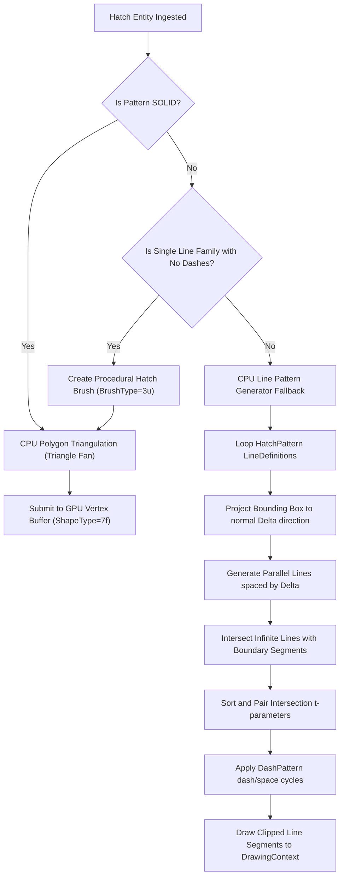

### C. Homogeneous 4D Rational Splines (NURBS)
Standard spline engines evaluate curve segments in 2D or 3D Cartesian coordinates, failing to represent conic sections (circles, ellipses, hyperbolas) accurately without heavy polygon subdivision. The upgraded engine implements a fully homogeneous **4D rational spline evaluator** based on De Boor's algorithm:

1. Control points $P_i = (x_i, y_i)$ are projected into 3D homogeneous coordinates by incorporating their weights $w_i$:
   $$d_i^{(0)} = \begin{bmatrix} w_i x_i \\ w_i y_i \\ w_i \end{bmatrix} \quad \forall i \in \{0, \dots, n\}$$
2. For a given knot parameter $u$ within the active knot span $[t_k, t_{k+1}]$, the De Boor recurrence relation is evaluated:
   $$d_j^{(r)} = (1 - \alpha_j) \cdot d_{j-1}^{(r-1)} + \alpha_j \cdot d_j^{(r-1)}$$
   where the weight-blended factor $\alpha_j$ is:
   $$\alpha_j = \frac{u - t_i}{t_{i + p + 1 - r} - t_i}$$
3. The final 3D homogeneous coordinate vector $d_p^{(p)} = [X_h, Y_h, W_h]^T$ is projected back to 2D Cartesian coordinate space via division:
   $$P(u) = \begin{bmatrix} X_h / W_h \\ Y_h / W_h \end{bmatrix}$$
This mathematically guarantees CAD-perfect NURBS curves with variable weights and knot vectors.

### D. B-Rep 3D SAT and SAB (Standard ACIS Binary) Projections
3D Solid components (`3DSOLID`, `REGION`, `BODY`) in modern DXF files contain boundary representation (B-Rep) databases stored in either ACIS SAT (textual) or ACIS SAB (Standard ACIS Binary) formatting. To support SAB, the engine implements a binary stream token-based decoder:

#### 1. Binary SAB Token-Based Stream Scanning
`AcisSabParser` scans the raw binary byte stream sequentially, decoding tokens based on two-way parsing strategies:
* **Standard Tagged Parsing (SAB Native):** Evaluates binary tags:
  * `0x01` (Integer Tag): Decodes 4-byte 2's complement integers.
  * `0x02` (Double Tag): Decodes 8-byte IEEE 754 floating-point coordinates.
  * `0x0C` (Pointer Tag): Decodes 4-byte reference pointer indices.
  * `0x03` & `0x04` (String Tags): Decodes length-prefixed entity type names (e.g., `edge`, `vertex`, `point`).
* **Tag-less Sequential Fallback:** If stream tags are absent, the parser reads raw binary primitives sequentially according to fixed B-Rep entity structures (e.g., `body`, `lump`, `shell`, `face`, `loop`, `coedge` have 4 pointer fields; `edge` has 5 pointers; `vertex` has 2 pointers; `point` has 1 pointer + 3 doubles; `straight`/`ellipse`/`intcurve` have 1 pointer).

#### 2. Entity Relation Reconstruction
The parser reconstructs the B-Rep relationships to isolate `edge` records, tracing vertices to points to extract 3D Cartesian start/end coordinates:
$$V_{\text{start}} = (x_s, y_s, z_s), \quad V_{\text{end}} = (x_e, y_e, z_e)$$

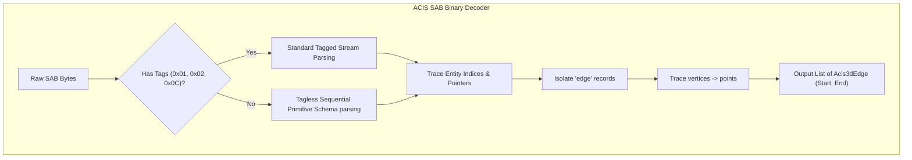

### E. Zero-Overhead GPU-Side 3D Line Projections ($ShapeType = 8u$)
To offload 3D wireframe projections from the CPU, 3D line edges are projected directly on the GPU using specialized vertex shaders:
1. **Vertex Buffer Packing:** 3D coordinates $(x, y, z)$ are packed directly into the standard `VectorVertex` layout:
   * `Position` stores $(x, y)$ coordinates.
   * `TexCoord.X` stores the $z$ coordinate.
   * `ShapeType` is flagged as `8.0f`.
2. **GPU Projection:** In the WGSL vertex shader `vs_main`, when `sType == 8u`, the 3D position is reconstructed and transformed by the combined model-view-projection matrix:
   $$\mathbf{v}_{\text{local3D}} = \begin{bmatrix} x & y & z & 1 \end{bmatrix}^T$$
   $$\mathbf{v}_{\text{projected}} = \mathbf{M}_{\text{mvp}} \cdot \mathbf{v}_{\text{local3D}}$$
   $$\mathbf{v}_{\text{clip}} = \begin{bmatrix} x_p / w_p & y_p / w_p & 0 & 1 \end{bmatrix}^T$$

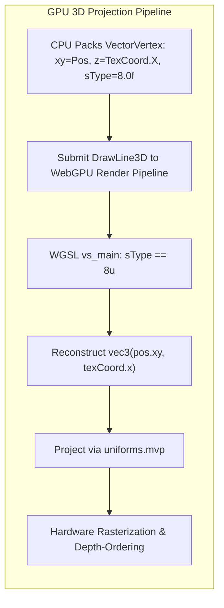

### F. Procedural GPU Cross-Hatching Brushes ($BrushType = 4u$)
To render cross-hatching and grid layouts without geometric division or vertex bloat, the engine implements procedural fragment shaders:
1. The cross-hatch parameters (rotation angle $\theta$, line spacing $s$, line thickness $t$, and color) are packed into uniform buffers.
2. In the WGSL fragment shader `fs_main`, two perpendicular line families are evaluated and unioned:
   $$M_1 = \left| \text{fract}\left(\frac{\vec{x}_{\text{local}} \cdot \vec{d}}{s}\right) \cdot s - \frac{s}{2} \right|$$
   $$M_2 = \left| \text{fract}\left(\frac{\vec{x}_{\text{local}} \cdot \vec{d}_{\text{perp}}}{s}\right) \cdot s - \frac{s}{2} \right|$$
   where $\vec{d} = (\cos\theta, \sin\theta)$ and $\vec{d}_{\text{perp}} = (-\sin\theta, \cos\theta)$.
3. The fragment is colored if:
   $$M_1 < \frac{t}{2} \quad \text{or} \quad M_2 < \frac{t}{2}$$

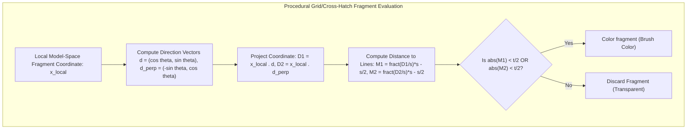

### G. Raw MULTILEADER Ingestion & Projective Rendering
The `MULTILEADER` entity is parsed directly from the raw DXF byte stream to support annotations:
1. **Raw Scanners:**
   * `CONTEXT_DATA{`: Extracts text insertion point $P_{\text{insert}}$, text height $H_{\text{text}}$, and the formatted MText value `304`.
   * `LEADER{` $\to$ `LEADER_LINE{`: Parses all sequential segment vertices $V_0, V_1, \dots$ of the leader line.
2. **CAD-Standard Arrowhead Generation:**
   An arrowhead tip is drawn at the start vertex $V_0$ pointing away from $V_1$. The arrowhead vertices are constructed:
   $$\vec{d} = \text{Normalize}(V_0 - V_1), \quad \vec{n} = (-d_y, d_x)$$
   $$L_{\text{arrow}} = \text{Clamp}(H_{\text{text}} \cdot \text{Zoom} \cdot 0.8, \ 6, \ 30), \quad W_{\text{arrow}} = L_{\text{arrow}} \cdot 0.35$$
   $$P_{\text{back}} = V_0 - \vec{d} \cdot L_{\text{arrow}}$$
   $$P_{\text{corner1}} = P_{\text{back}} + \vec{n} \cdot W_{\text{arrow}}, \quad P_{\text{corner2}} = P_{\text{back}} - \vec{n} \cdot W_{\text{arrow}}$$
   The resulting triangle polygon $(V_0, P_{\text{corner1}}, P_{\text{corner2}})$ is drawn using a solid-filled path.

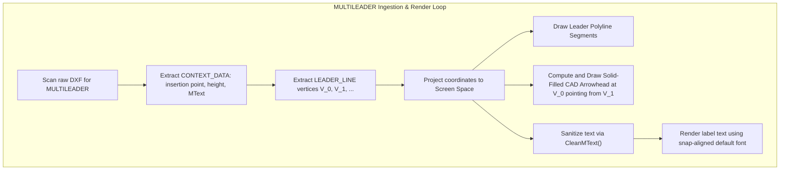
