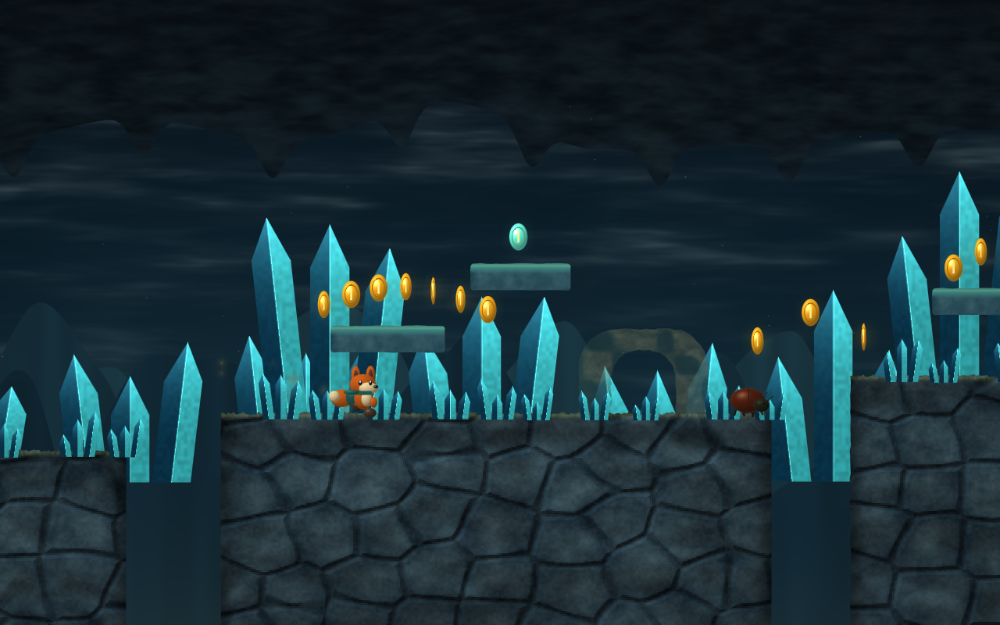
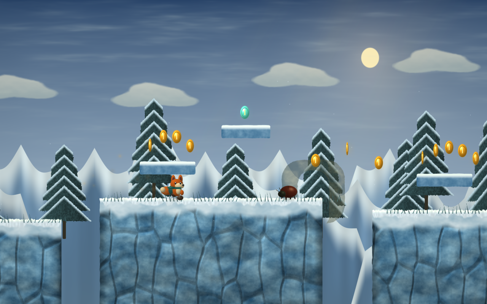

# Suntrail

An original scrolling 2.5D platform adventure: eight distinct worlds, a fox
courier, sunsparks, hidden relics, patrolling beetles, moving platforms, checkpoints,
and a final ending. All artwork is deterministic original WGSL; no downloaded game
assets, image generators, copied levels, or third-party game implementation are used.





## Run

Use .NET 10 and the repository's normal native WebGPU prerequisites. Run commands
from the repository root. Initialize `external/microsoft-ui-xaml` for Fluent resources.

```sh
git submodule update --init external/microsoft-ui-xaml
dotnet run --project src/ProGPU.Samples.Suntrail.Desktop -c Release
```

Desktop uses the existing GLFW host. macOS is the exercised desktop platform;
Windows and Linux use the same project and their existing ProGPU runtime packages.

```sh
dotnet publish src/ProGPU.Samples.Suntrail.Browser -c Release
python3 eng/serve-suntrail.py
```

Open `http://127.0.0.1:5187` in a WebGPU-enabled browser. Release publishes with
WebAssembly AOT. Deploy the published `wwwroot` under HTTPS with the COOP/COEP
headers shown in the development server. The browser bootstrap is shared with
ProGPU.Browser. Progress uses localStorage; private/blocked storage stays playable.

```sh
bash eng/build-wgpu-native-ios.sh
dotnet build src/ProGPU.Samples.Suntrail.iOS -c Release -r iossimulator-arm64
```

Install the resulting `.app` with Xcode or `xcrun simctl install booted <app-path>`.
Device builds use `-r ios-arm64` and require your signing/provisioning identity.
The simulator uses the interpreter; device Release retains AOT. Landscape is the
intended phone orientation. The host explicitly exports the static WebGPU C API
for Silk's startup symbol resolver. `NoSymbolStrip` preserves these runtime-resolved
exports through device Release post-processing (managed trimming and AOT remain enabled).
Verify the final packaged executable before installing it:

```sh
python3 eng/verify-suntrail-ios.py src/ProGPU.Samples.Suntrail.iOS/bin/Release/net10.0-ios/ios-arm64/ProGPU.Samples.Suntrail.iOS.app
```

## Play

| Action | Keyboard | Touch |
| --- | --- | --- |
| Move | Left/right or A/D | Floating/fixed thumbstick or arrow buttons |
| Jump | Space, W, or up; hold for height | Hold JUMP |
| Sprint | Shift | Outer thumbstick edge, automatic arrows, or separate RUN |
| Enter/leave a vault | Down or S while standing on a pipe | ↓ while standing on a pipe |
| Pause/resume | Escape or P | Pause / resume button |
| Continue / retry | Enter | Primary menu button |
| Return to checkpoint | R | Retry after falling |

Open Settings from the title or pause menu to choose a touch layout, sprint behavior,
and button size. Settings are saved on each device. Hold JUMP for the same full-height
arc as the keyboard; two independent fingers can move and jump simultaneously.

Land on beetles to bounce. Side contact and thorns cost one of three hearts.
Lanterns save a checkpoint; falling allows unlimited retries and retains collected
sunsparks. Reach the glowing arch to unlock the next island. Relics are optional
exploration goals. The island menu replays unlocked stages. Losing focus pauses the
game and clears held input. Unlocks are saved locally; no account or network service
is required.

## Worlds

| World | Artwork and route character |
| --- | --- |
| Verdant Isles | Rough orchard canopies, moss, roots, ferns, gentle meadow leaps |
| Sandstone Reach | Layered sandstone, palms, a repeated aqueduct, broad elevated shelves |
| Lumen Caverns | A dark rock ceiling, faceted crystals, ascending shelves and vertical lifts |
| Tidal Kingdom | Broken coastal causeways, distant horizontal sea, reeds, longer low terraces |
| Autumn Highlands | Copper canopies, falling leaves, climbs and descents through tall terraces |
| Frostbound Peaks | Snow boughs, ice fractures, snowfall, alternating heights and vertical lifts |
| Obsidian Forge | Basalt columns, warm fissures, ember sea, denser thorn challenges |
| Celestial Gardens | Marble pillars, pale ledges, cloud colors, the longest sequence of upper routes |

Each world has paired pipes to an optional underground vault. Enter at the first
pipe and leave by the far pipe to emerge farther along the surface route; the
near pipe returns to the entrance. Collected coins persist across visits, and
retry returns to the surface checkpoint. Vault geometry and materials vary by world.
Selected upper galleries and relic routes add oscillating saws, flame jets with
advance warning, and crushers with a slow retraction and rapid drop.

Each world has its own authored elevation score, section lengths, obstacle rhythm,
three optional relic routes, and two checkpoints. The campaign uses 10–13 ground
sections per world. Horizontal ferries and vertical lifts use the same collision and
carry rules as the player. Windmills and vertical waterfall strips are removed.
Materials use original bounded noise, fractured height shading, bark/fur detail,
soft dust, atmospheric shafts, and three local lantern/portal lights. The artwork
remains a procedural stylized interpretation, not photorealistic scanned assets.

## Structure and checks

- `ProGPU.Samples.Suntrail`: shared WinUI interface, fixed 120 Hz simulation,
  deterministic level grammar, bounded artwork batch, drawing-context extension,
  and one canonical shader.
- `.Desktop`, `.iOS`, `.Browser`: platform startup and packaging.
- `.Tests`: input-only completion of all eight stages, simulation regressions,
  warm simulation/batch allocation checks, native GPU validation, eight-world
  captures, UI captures, and unchanged-frame upload checks.

```sh
dotnet test src/ProGPU.Samples.Suntrail.Tests -c Release
dotnet run --project src/ProGPU.Samples.Suntrail.Desktop -c Release -- \
  --benchmark artifacts/suntrail/release-run 1200
```

`--world 1` through `--world 8` selects a starting world for focused play or measurement.
`--autoplay` enables the input-only route pilot without the benchmark recorder.
`--no-occlusion` disables conservative background culling for same-binary comparisons.
The benchmark writes raw CSV plus startup, host-frame/compositor percentiles, allocations,
uploads, and resource counters. Instrumented runs must be reported separately from
normal frame rates. See [design/research](suntrail-design.md) and
[validation evidence](suntrail-validation.md).

The extension is a full-window game surface. It owns its projection and one
compositor/device's buffers; it is not a general masked/nested drawing primitive.
The independent C++ retained renderer is outside this WinUI sample's host contract.

Expanded campaign work, Mario format import/edit support, and full 3D remain in
[the work list](suntrail-work-list.md). These features are not all implemented yet.


For deterministic offscreen GPU measurements, run the Desktop executable with
`--render-benchmark OUTPUT_PREFIX off|coverage|on 600 [WORLD]`. World is 1–8
(default 1): `off` disables the two experimental switches, `coverage` enables the
normal early-coverage optimization, and `on` tests only the optional sky cache.
Each run warms 120 frames and records 600 frames of identical simulation input;
CSV timings measure serialized completion latency, not displayed FPS. Ordinary
play enables early coverage and keeps the sky cache off unless `--sky-cache` is set.


The main campaign now alternates short crossings with authored chambers and terraces.
Low tunnels have a walking route beneath the roof and optional steps onto it; some
relics sit above those passages. Later worlds put saws, flame gates and crushers on
the main route. Lantern checkpoints recognize upper-route crossings and always
respawn you on their safe floor.


## Level workshop

Choose **Level workshop** from the title or pause menu. Drag a palette item onto
the map, or tap a tool and then tap the map. **Select / drag** moves existing
objects; **Undo**, **Redo**, **Delete**, and width controls edit the draft. **World**
cycles the eight procedural environments. **Play test** starts a separate playable
snapshot. Pause and return to the workshop to resume editing; playtest completion
does not unlock campaign levels.

The workshop opens an editable three-room example: an orchard with two branches,
a crystal dungeon with a crusher and moving crossing, and a skybridge route.
**Room ← / →** switches the active room; **+ Room** adds a room, and **Surface /
dungeon** changes its environment treatment. **World** changes that room's biome.
Select a pipe and press **Connect pipe**, select its destination (switching rooms
if needed), then press **Connect pipe** again. Matching pipe labels show the link
number. **Unlink pipe** clears both endpoints. Deleting a pipe or room removes its
connections; undo restores the whole trail. Stand on a connected pipe and use Down,
S or the touch pipe control to travel. Room pickups and enemies retain their state
across visits, and death returns to the most recently activated checkpoint's room.
An exit in any room completes the custom trail.

**Save** writes a `.suntrail` version 2 JSON document. **Open** accepts v1 and v2 files
and finite orthogonal Tiled `.json` / `.tmj` / `.tmx` maps, directly or in ZIP packages. The object-map adapter
uses rectangle and point objects with a gameplay class: `ground`, `ledge`,
`moving`, `crate`, `pipe`, `stone`, `coin`, `relic`, `enemy`, `hazard`, `checkpoint`,
`spawn`, `exit`, `saw`, `flame`, or `crusher`. Map properties `suntrail.name` and
`suntrail.biome` select the title and environment (0–7). Object properties
`travel`, `phase`, and `verticalTravel` configure supported movement. Nested
object groups and pixel offsets are supported. Coordinates use the game's
logical units; spawn uses the player's top edge, checkpoint/exit use floor
height, and coin/relic use their center. Enemy collision size is 42 × 34.

The palette also includes `spring`, `conveyor`, `ice` and `crumble`. Springs launch
you automatically; hold Jump for a higher launch. Conveyors carry the player along
the belt; **Reverse belt** changes the selected conveyor's direction. In files,
conveyor `travel` is its signed speed in world units/second (zero selects +110),
and `verticalTravel` must be zero. Ice needs a longer braking distance. Crumbling
ledges crack and shake for 0.55 seconds after contact, disappear for 2.5 seconds,
then return. Jump onward before they collapse. These behaviours are available in
custom rooms as well as the authored campaign encounters.

Import is a conversion into Suntrail gameplay geometry and procedural artwork.
Tiled editor colors, visibility, opacity and drawing order do not select gameplay
rules. Saving creates a Suntrail copy; it does not round-trip Tiled metadata.
Image layers, rotated/nonrectangular objects, templates, imported image artwork,
NES cartridges and SMBX files are not implemented yet. Imported Tiled pipes begin
as solids; connect them in the workshop to assign travel destinations.

Documents are capped at 1 MiB, eight rooms and 256 objects per room, with bounded
coordinates, motion and procedural artwork cost. Each room needs one spawn and exit.
Every additional room must have a pipe route from the first room. Version 2 retains
the v1 root fields and adds `dungeon`, a flat `rooms` array (excluding the first room),
and an optional integer `pipeLink` on pipe objects. Every nonzero link (1–1024)
must occur exactly twice across the trail. Nested trails are rejected. Validation
checks structural limits; authors must still playtest reachability. Save drafts
before leaving the application; automatic draft recovery is not implemented.

The independent readers follow the official [Tiled JSON specification](https://doc.mapeditor.org/en/stable/reference/json-map-format/)
and [TMX specification](https://doc.mapeditor.org/en/stable/reference/tmx-map-format/).
Only their public field contracts informed this original implementation; no Tiled
source or commercial game assets are included. Paired authored JSON/TMX fixtures
verify equivalent geometry and ordinary-input playtest completion.


## Application-owned GPU registration

Suntrail uses the public typed registration API from merged [PR #159](https://github.com/wieslawsoltes/ProGPU/pull/159).
Its shared `DrawingExtension<ProceduralBatch>` definition creates a separate
`ProceduralPipeline` for each compositor. `App` registers it on the window before
activation, and the drawing-context helper records it with local bounds. Mobile
surface recreation automatically receives a fresh pipeline; numeric extension IDs
and manual registration in the activation handler are removed.

The application uses public APIs only. Its test assembly's existing friend access
is limited to installing/restoring the application's resource scope in fixtures.
See [package-consumer usage and ownership](../drawing-extensions.md). The API is
merged into main; it still needs a package release before consumers can use it from
an ordinary published NuGet version.


### Tiled tile layers

Finite tile layers support JSON integer arrays and TMX CSV or individual `<tile>`
elements. Both formats also accept base64 data containing little-endian 32-bit tile
IDs, optionally compressed with gzip or zlib. Embedded tileset `type` / `class`
values use the same gameplay names as object layers. Multiple tilesets, sparse
local IDs and nested pixel offsets are resolved before compiling gameplay objects.

Contiguous static `ground`, `ledge` and `stone` cells with matching properties merge
into collision rectangles. Individual actors, moving platforms and mechanisms keep
their identity. Coins use cell centers; spawn/enemy markers align their feet with
the bottom of the cell; checkpoints and exits use bottom-center coordinates.
Horizontal/vertical/diagonal tile flags preserve symmetric whole-cell solids;
transformed actors and mechanisms report an unsupported-transform error. The stale
hexagonal rotation bit is cleared for orthogonal maps as required by Tiled's
[GID contract](https://doc.mapeditor.org/en/stable/reference/global-tile-ids/).

The importer caps all layers together at 65,536 cells and 4,096 tilesets/gameplay
definitions, then enforces the usual 256-object/artwork limits. Decompression reads
only the declared cell bytes and checks for extra or missing data. Invalid IDs,
overlapping tileset ranges and unsupported encodings fail transactionally. External
TSX/TSJ definitions can be supplied in ZIP packages as described below. Zstd
compression, infinite chunks and custom per-tile collision object groups remain open.
Use whole-cell classes for this lane.
Tileset images are not imported: the map becomes Suntrail procedural gameplay art.

The independently authored [tile-crossing fixture](levels/tile-crossing.tmx) has
three stretches of ground separated by two gaps. It imports, plays to completion
and remains editable. Its 504 solid cells compile to three ground rectangles.
This extends Tiled compatibility; it does not establish NES or SMBX compatibility.


## Tiled packages and external tilesets

The shared **Open** picker accepts `.zip` files containing a map and its referenced
TSX/TSJ/JSON tileset definitions. Keep relative paths intact when zipping the folder.
External definitions use the map's `firstgid`; the referenced tileset does not define
its own `firstgid`. Each definition is parsed once per map, including repeated references.
The importer follows the official [Tiled JSON](https://doc.mapeditor.org/en/stable/reference/json-map-format/#tileset)
and [TMX](https://doc.mapeditor.org/en/stable/reference/tmx-map-format/#tileset)
contracts. Terrain still receives Suntrail's procedural artwork; this does not import
the tileset's image appearance.

A package containing one map opens directly. For several maps, include one
`suntrail.package.json` file. Paths below are relative to that manifest, so the ZIP
may contain an enclosing folder:

```json
{
  "format": "suntrail-package",
  "version": 1,
  "entry": "maps/orchard.tmj",
  "rooms": ["maps/vault.tmx", "maps/sky.tmj"]
}
```

The listed maps become one editable trail. Set the Tiled map boolean property
`suntrail.dungeon` for dungeon rooms, and assign integer object property
`suntrail.pipeLink` to each connected pipe. Two endpoints with the same nonzero
number connect even when in different map files. Every room still needs one spawn
and one exit, and every room must be reachable through the pipe graph. Saving
converts the full graph to a version 2 `.suntrail` document; it does not overwrite
or round-trip the original Tiled files and their unrelated editor metadata.

Package references resolve only within the supplied package. No paths are extracted,
no URLs or absolute filesystem references are followed. Standard single-disk stored
and deflated ZIPs are supported, with checksum validation, at most 128 entries,
16 MiB compressed, 32 MiB expanded and 8 MiB per file. Individual map/tileset definitions
remain capped at 1 MiB. Encrypted, multi-disk and ZIP64 archives are not implemented.
Standalone maps with external definitions should be opened as a package; the shared
picker grants access to one selected file rather than all of its neighbouring files.

Host integrations can supply an `AssetBundle` to the typed `LevelFiles.Read` overload
without a ZIP or ambient filesystem access. `AssetBundle.FromFiles` owns a snapshot of
the explicitly supplied bytes. Package work is confined to import; gameplay and
rendering use the compiled immutable level data.

Developer rendering comparisons also accept `--shared-instances` on Desktop and
`SUNTRAIL_SHARED_INSTANCES=1` in the existing desktop/iOS measurement driver. This
experimental mode shares source sprite records between their material pages and
retains unchanged buffer ranges. It can run independently of the experimental
world depth pass. Both new modes remain disabled in normal gameplay while final
build, shader, image and performance validation is pending. They have not been
installed on the iPhone; see the [engine design](suntrail-engine.md) for scope and
measurement limits.

The additional developer switch `--scene-instances` (measurement environment:
`SUNTRAIL_SCENE_INSTANCES=1`) enables camera-independent world sources and groups
changing records separately in GPU storage. It implies shared instances/material
pages and can be combined with the world depth pass. It is also experimental and
awaits final build, image and device performance validation.

### Campaign route update (coding complete for this batch; QA pending)

The eight worlds now use distinct encounter scores: orchard canopy forks and creek
ferries, broken aqueduct arches, crystalline stairs and fragile galleries, tidal
piers and twin ferries, copperleaf spring routes, glacier braking pads, furnace
pressing belts and flame gates, and sky relays. Each world also has its own named
vault layout. An early and late pipe connect to the two ends of that vault; its
late overworld exit provides a checkpoint. Three relics remain on each overworld
route, with bonus coins in its vault.

Custom levels accept `hopper` and `hoverer` enemy classes in addition to `enemy`.
All three use a 42 × 34 body. Travel sets the horizontal patrol span; phase offsets
the hop or hover cycle. Their stored Y coordinate is the ground-relative anchor:
hoppers rise up to 96 units with a resting interval; hoverers fly 66–134 units
above that anchor. They appear in the drag-and-drop palette and save through the
same Suntrail JSON and explicit Tiled-class adapters. These original behavior
profiles do not establish compatibility with similarly named foreign-engine IDs.

This route and enemy revision has not yet been built or playtested. Earlier
iPhone performance measurements and installed builds do not include it.
